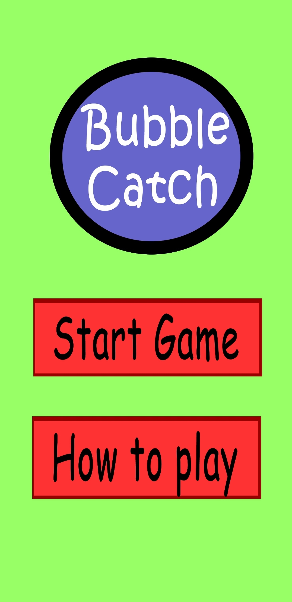
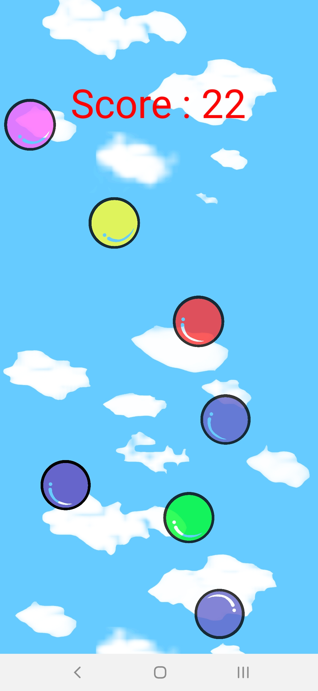
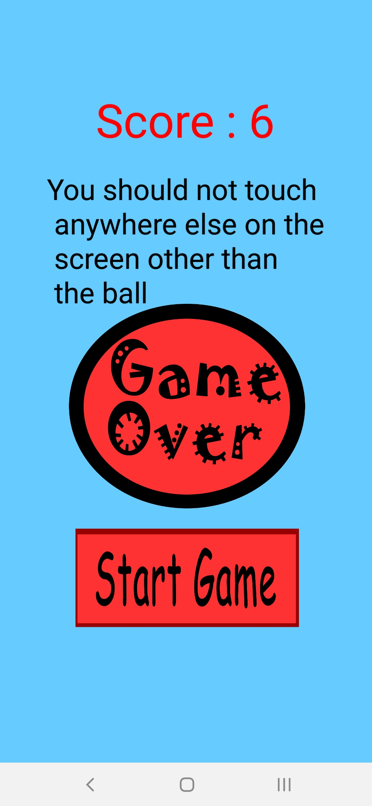

## Bubble Catch
### Mobile game developed using Corona SDK.
Players collect particular color bubbles falling from the sky without touching any other colored bubbles and obstacles accross. 

This has to be done without removing the fingers from the screen. 

A bubble missed will end the game. Speed increases with time.

__Home Screen:__

__PlayGround Screen:__
Purple colored bubble is assigned to the player.

__GameOver Screen:__
Final Score and the reason for getting out is displayed. 
